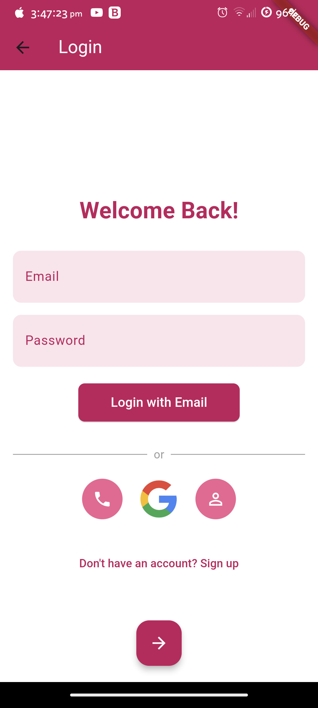
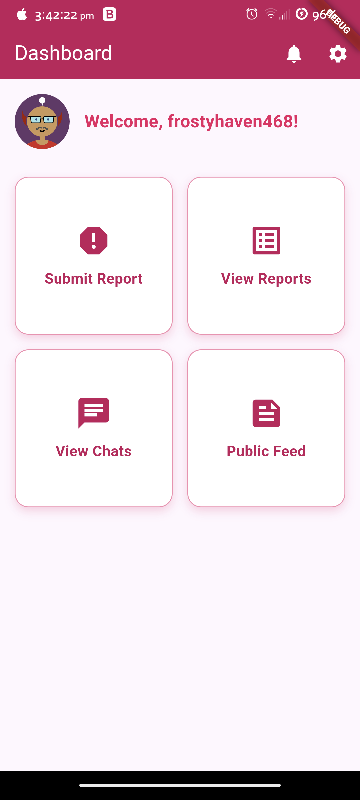
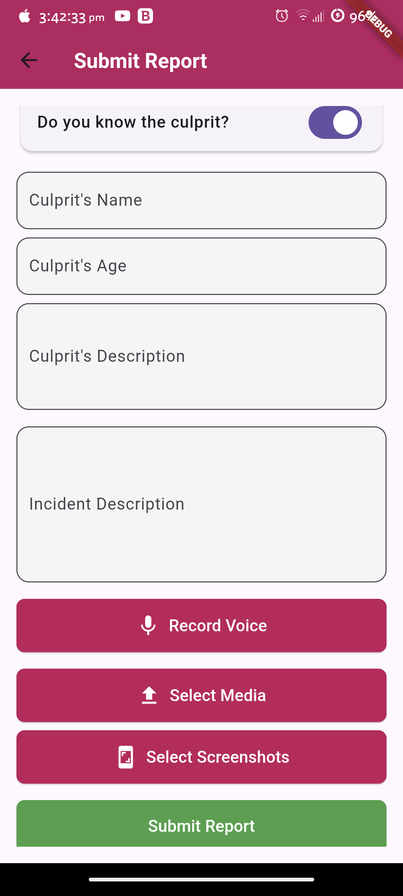
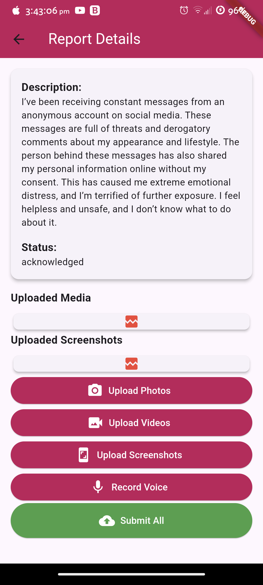
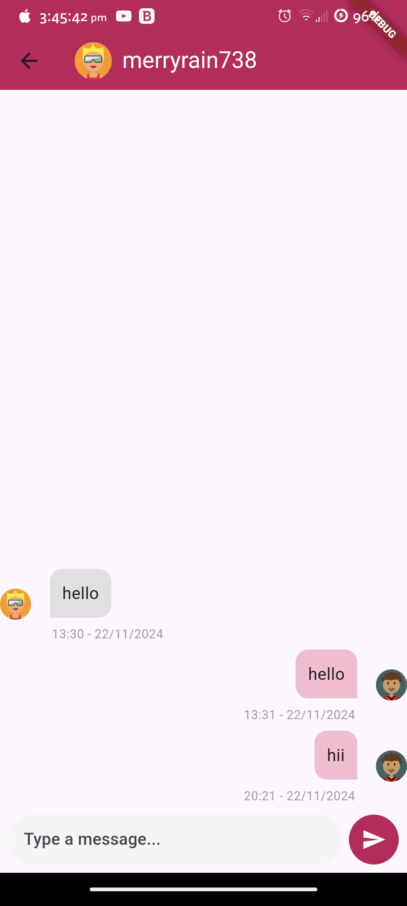
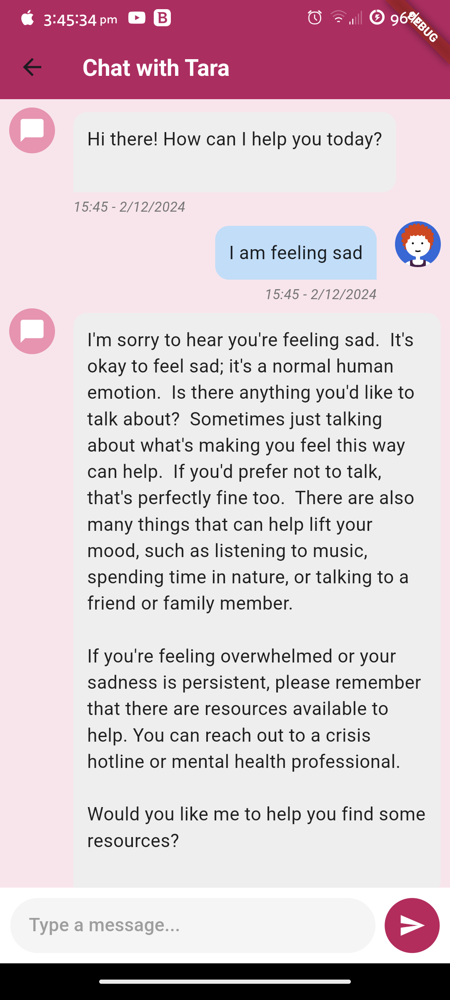
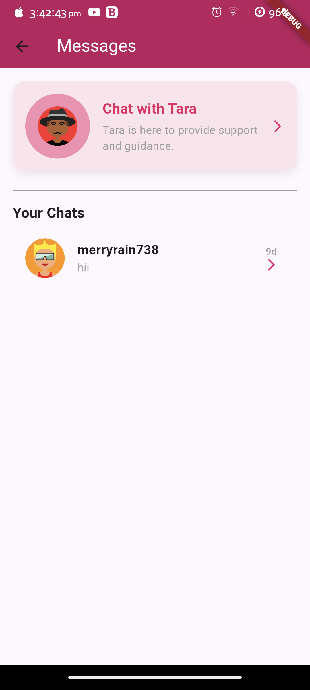
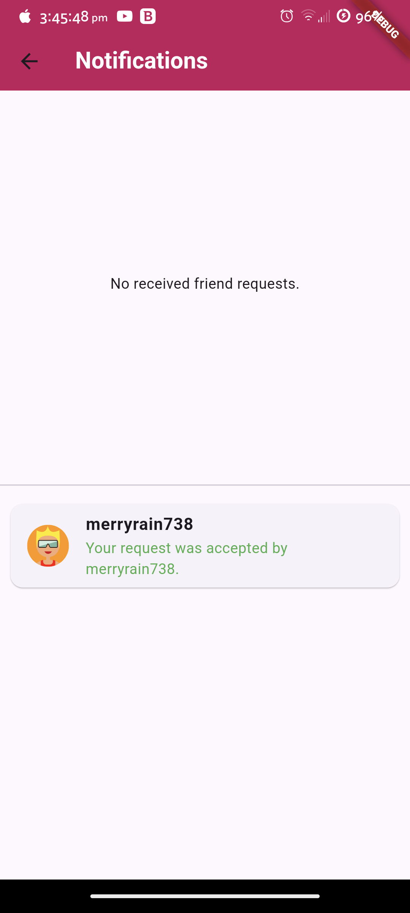
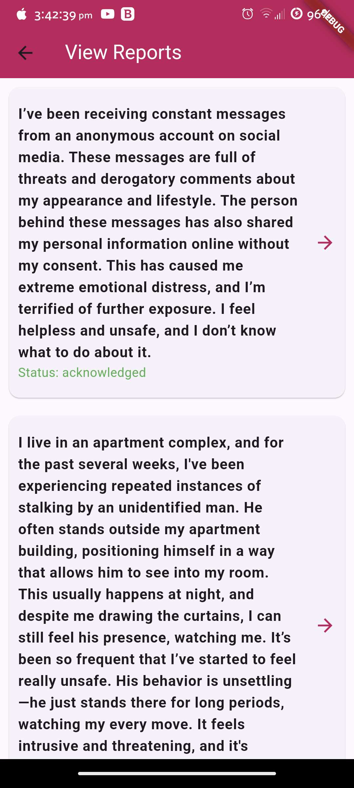
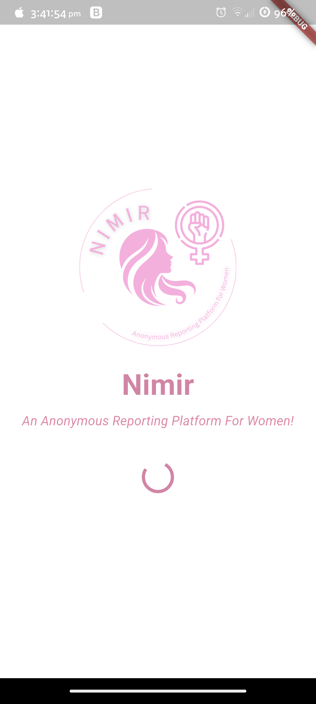

# Nimir - Anonymous Reporting Platform for Women

**Nimir** is an anonymous reporting platform designed to provide a secure and confidential way for individuals to report incidents related to women's safety. Built with a focus on privacy and security, Nimir integrates AI-driven validation, end-to-end encryption, and direct communication with authorities, ensuring sensitive data remains protected while empowering individuals to report incidents without fear.

## Introduction

**Nimir**, meaning "empower" in Tamil, provides a safe space for women to report unsafe situations or incidents anonymously. Whether it's harassment, violence, or other safety concerns, Nimir enables users to report their experiences without revealing their identity. Built using **Flutter** and **Firebase**, it ensures a user-friendly, secure, and highly confidential platform for reporting incidents and tracking their progress.

---

## Features Overview

### 1. **User Authentication & Anonymous Reporting**
   - Secure and anonymous user authentication to maintain privacy.
   - Report incidents anonymously without revealing user identity.
   - Allows multiple types of reports (harassment, violence, etc.), ensuring full confidentiality.

### 2. **AI-Driven Incident Validation**
   - AI-driven validation system to check for the authenticity of reports.
   - Automatic classification of incidents based on severity (e.g., urgent or non-urgent).
   - Ensures only legitimate reports are forwarded to authorities.

### 3. **End-to-End Encryption**
   - All data, including reports and messages, are encrypted end-to-end for maximum security.
   - Ensures that only the intended recipient (e.g., authorities) can decrypt and view the information.

### 4. **Communication with Authorities**
   - Direct communication with authorities through a secure messaging system.
   - Authorities can review, track, and provide feedback on reports in real-time.

### 5. **Incident Tracking**
   - Real-time incident tracking, allowing users to check the status of their reports.
   - Users receive updates and can also communicate with the authorities for further clarification.

### 6. **Public Feed (Anonymous)**
   - An anonymous feed displaying updates and messages related to women's safety.
   - Allows users to stay informed about recent incidents and actions taken.

### 7. **Notifications**
   - Users and authorities receive notifications for status updates on reports.
   - Users can track when their report is reviewed, acknowledged, or acted upon.

### 8. **Admin Dashboard**
   - A backend dashboard for authorities to review submitted reports.
   - Provides a summary of all active and resolved reports, helping authorities stay organized.

---

## Technical Stack

- **Frontend**: Flutter for creating cross-platform user interfaces.
- **Backend**: Firebase Firestore for real-time data storage, Firebase Authentication for user login and management.
- **Encryption**: End-to-end encryption using AES (Advanced Encryption Standard).
- **AI Validation**: AI-based validation system for incident classification.

---

## Firebase Configuration

To use **Nimir**'s backend features, you need to set up **Firebase**:

1. **Create a Project**: Start by creating a new project in the [Firebase Console](https://console.firebase.google.com/).
2. **Configure Firebase**:
   - **Android**: Download and add the `google-services.json` file to the Android project directory.
   - **iOS**: Download and add the `GoogleService-Info.plist` file to the iOS project directory.
   - Follow the Firebase setup guide to integrate Firebase SDK into your Flutter project.
3. **Enable Firestore and Authentication**:
   - Enable **Firestore** for storing report data.
   - Enable **Firebase Authentication** for managing user sign-up, login, and account security.

---

## Usage

### Example Screens

Below are some example screenshots of the **Nimir** app, giving you an idea of the user interface and functionality:

## Screenshots

### **1. User Login & Dashboard Screens**  

   
   

### **2. Incident Reporting & Submission**  

   
   

### **3. Chat & Messaging**  

   
   
   

### **4. Notifications & Public Feed**  

   
   

### **5. Submitted Reports**  

   

### **6. Splash Screen**  

   

---

## Key Goals of Nimir

1. **Anonymous Reporting**: Provide a safe, anonymous way for individuals to report incidents without revealing their identity.
2. **Secure Data Handling**: Ensure all data is encrypted and only accessible to authorized parties.
3. **AI-Powered Incident Validation**: Automatically validate reports using AI, helping authorities prioritize incidents.
4. **Empowering Women’s Safety**: Help create a safer environment for women by making it easy to report and track safety incidents.

---

## Upcoming Features

1. **Live Chat with Authorities**: Add live chat functionality to allow users to directly communicate with authorities in real-time.
2. **Geolocation for Incident Reporting**: Integrate GPS to include location-based incident reporting and tracking.
3. **Multilingual Support**: Provide multilingual support to make the app accessible to more users across different regions.
4. **Emergency Button**: A panic button for immediate reporting during critical situations.

---

## Contributing

**Nimir** is an open-source project, and contributions are always welcome to enhance and expand its features. If you’d like to contribute:

1. **Fork the Repository**: Click on the "Fork" button at the top of this page.
2. **Create a Branch**: Create a branch specific to the contribution you intend to make.
3. **Make Changes**: Implement your changes or improvements in the new branch.
4. **Create a Pull Request**: Submit your changes for review by creating a pull request.

> Please make sure to follow the project's guidelines and maintain consistency across the app when contributing.

---

## License

**Nimir** is licensed under the [MIT License](https://choosealicense.com/licenses/mit/). Feel free to use and modify it to fit your needs.

---

## Contact & Support

For more information or support, please reach out via:

- **Email**: [rahulbabuoffl@gmail.com](mailto:rahulbabuoffl@gmail.com)
- **Website**: [Official Website](https://rahulbabump.online)
- **GitHub Repository**: [GitHub](https://github.com/rahulthewhitehat/nimir)

We believe that **Nimir** can help make a significant impact on women’s safety, empowering them to report incidents anonymously and securely.

**Nimir - An Anonymous Reporting Platform** 🌱
